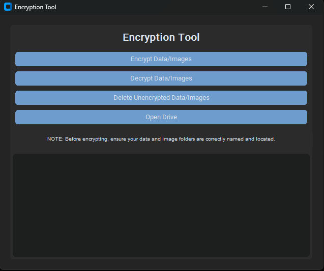

# Encrypt Decrypt Tool

This repository contains a Python script with a Tkinter-based GUI for encrypting and decrypting folders. The script provides a simple and secure way to manage sensitive data by compressing and encrypting folders using OpenSSL.

## Features

- **Encrypt Folders**: Compress and encrypt folders using AES-256 encryption.
- **Decrypt Folders**: Decrypt and extract previously encrypted folders.
- **Delete Folders**: Securely delete folders after encryption.
- **Open Drive**: Quickly navigate to the drive containing your encrypted files.

## Prerequisites

- **Python 3.x**: Ensure Python is installed on your system.
- **OpenSSL**: This script relies on OpenSSL for encryption and decryption. Ensure it is installed and accessible from the command line.
- **Tar**: The script uses `tar` to compress files before encryption. Ensure it is installed and available.

## Setup

1. **Clone the Repository**:
   ```bash
   git clone https://github.com/yourusername/encrypt_decrypt_tool.git
   cd encrypt_decrypt_tool
   ```

2. **Install Dependencies**:
   There are no external Python dependencies required beyond Tkinter, which comes pre-installed with Python. Ensure OpenSSL and tar are available on your system.

## Usage

1. **Run the Script**:
   ```bash
   python Encrypt_Decrypt_Tool.py
   ```

2. **Encrypt Folders**:
   - Select the "Encrypt JST Data/Images" button to compress and encrypt your folders.
   - Enter the password when prompted.

3. **Decrypt Folders**:
   - Select the "Decrypt JST Data/Images" button to decrypt and extract your folders.
   - Enter the password used during encryption.

4. **Delete Folders**:
   - Select the "Delete Unencrypted JST Data/Images" button to securely delete the original, unencrypted folders.

5. **Open Drive**:
   - Select the "Open JST Drive" button to navigate to the drive containing your encrypted files.

## Customization

- **Drive and Folder Paths**:
  - The script automatically detects available drives (e.g., `E:` or `J:`). You can modify the list of drives in the script to fit your environment.
  - The default folder names for data and images can be customized within the script.

- **Encryption and Decryption Settings**:
  - The script uses AES-256 encryption with a PBKDF2 key derivation function. You can modify these settings if necessary.
 
## Screenshots



## License

This project is licensed under the MIT License. See the [LICENSE](LICENSE) file for more details.
